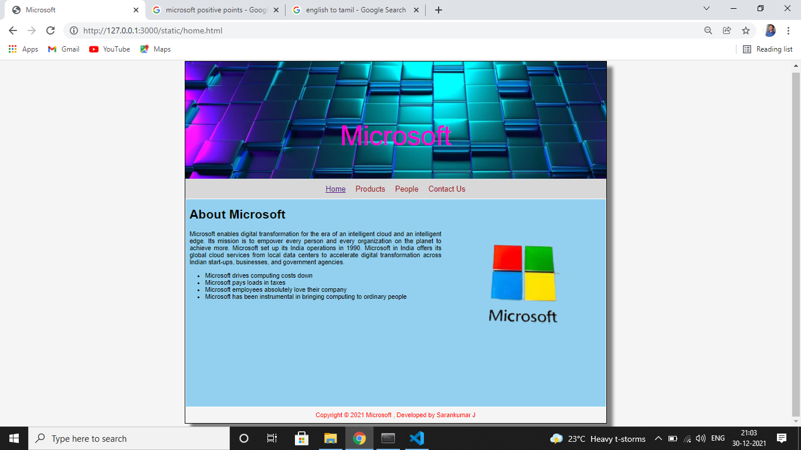
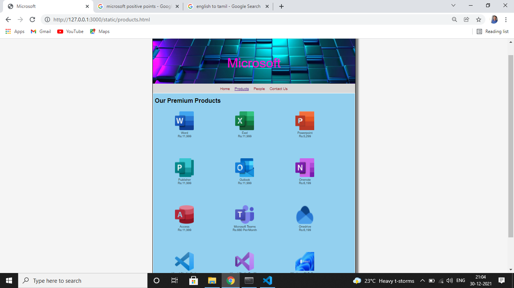
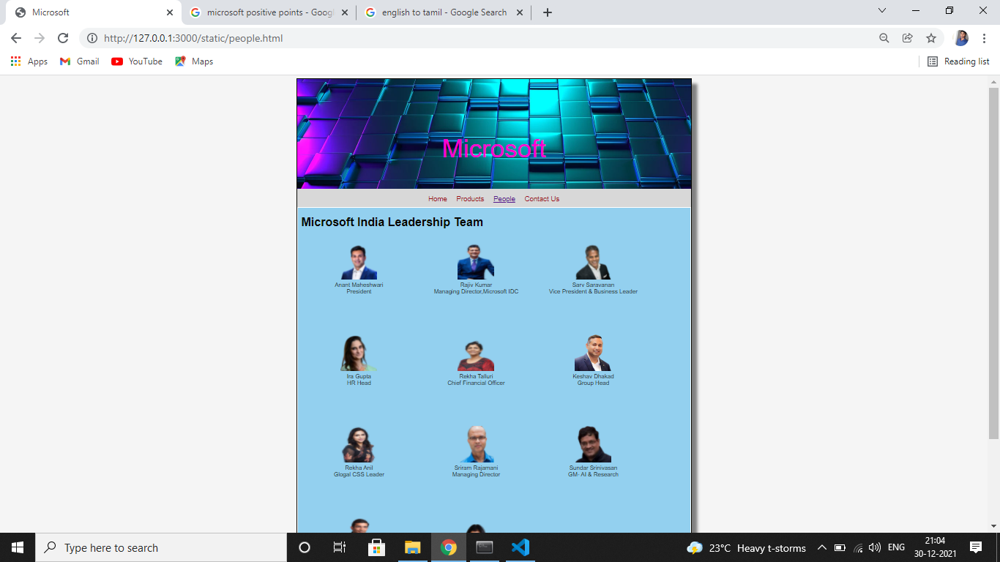
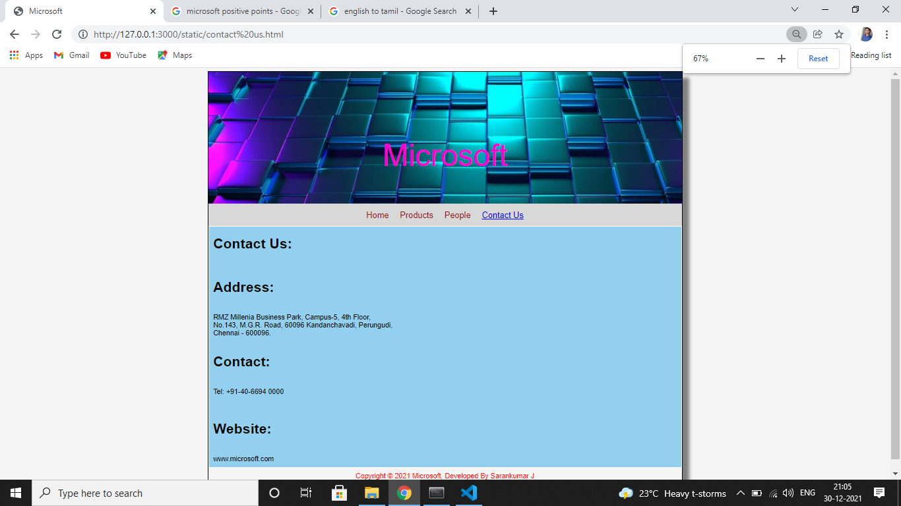

# Web Design for a Software Product Company

## AIM:

To design a static website for a software product company company.

## DESIGN STEPS:

### Step 1:

Requirement collection.

### Step 2:

Creating the layout using HTML and CSS.

### Step 3:

Updating the sample content.

### Step 4:

Choose the appropriate style and color scheme.

### Step 5:

Validate the layout in various browsers.

### Step 6:

Validate the HTML code.

### Step 6:

Publish the website in the given URL.

## PROGRAM :

## HOME PAGE:

```
<!DOCTYPE html>
<html lang="en">
  <head>
    <title>Microsoft</title>
    <link rel="stylesheet" href="./css/layout.css" />
    <link rel="icon" href="./img/icon.png" type="image/x-icon" />
  </head>

  <body>
    <div class="container">
      <div class="banner">Microsoft</div>
      <div class="menu">
        <div class="menuitemselected"><a href="/static/home.html">Home</a></div>
        <div class="menuitem"><a href="/static/products.html">Products</a></div>
        <div class="menuitem"><a href="/static/people.html">People</a></div>
        <div class="menuitem"><a href="/static/contact us.html">Contact Us</a></div>
      </div>
      <div class="content">
        <div class="homecontent">
          <h1>About Microsoft</h1>
          
          <div class="contenttext">
            Microsoft enables digital transformation for the era of an intelligent cloud and an intelligent edge.
             Its mission is to empower every person and every organization on the planet to achieve more. 
             Microsoft set up its India operations in 1990. 
             Microsoft in India offers its global cloud services from local data centers to accelerate digital transformation across Indian start-ups,
              businesses, and government agencies.
            <ul>
              <li>Microsoft drives computing costs down</li>
              <li>Microsoft pays loads in taxes</li>
              <li>Microsoft employees absolutely love their company</li>
              <li>Microsoft has been instrumental in bringing computing to ordinary people</li>
            </ul>
          </div>
        </div>
      </div>
      <div class="footer">
        Copyright &#169; 2021 Microsoft , Developed by Sarankumar J
      </div>
    </div>
  </body>
</html>
```

## PRODUCTS PAGE:
```

<!DOCTYPE html>
<html lang="en">
  <head>
    <title>Microsoft</title>
    <link rel="stylesheet" href="./css/layout.css" />
    <link rel="icon" href="./img/icon.png" type="image/x-icon" />
  </head>

  <body>
    <div class="container">
      <div class="banner">Microsoft</div>
      <div class="menu">
        <div class="menuitem"><a href="/static/home.html">Home</a></div>
        <div class="menuitemselected"><a href="/static/products.html">Products</a></div>
        <div class="menuitem"><a href="/static/people.html">People</a></div>
        <div class="menuitem"><a href="/static/contact us.html">Contact Us</a></div>
      </div>
      <div class="content">
        <div class="productcontent">    
          <h1>Our Premium Products</h1></br>
          <div class="productitems">
              <div class="productitem"> 
                  <div class="itemimage">
                  
                  </div>
                  <div class="itemname">Word</div>
                  <div class="itemprice">Rs:11,999 </div>
              </div>
              <div class="productitem"> 
                  <div class="itemimage">
                  
                  </div>
                  <div class="itemname">Exel</div>
                  <div class="itemprice">Rs:11,999</div>
              </div>
              <div class="productitem"> 
                <div class="itemimage">
                
                </div>
                <div class="itemname">Powerpoint</div>
                <div class="itemprice">Rs:5,299</div>
            </div>
            <div class="productitem"> 
              <div class="itemimage">
              
              </div>
              <div class="itemname">Publisher</div>
              <div class="itemprice">Rs:11,999 </div>
          </div>
          <div class="productitem"> 
            <div class="itemimage">
            
            </div>
            <div class="itemname">Outlook</div>
            <div class="itemprice">Rs:11,999 </div>
        </div>
        <div class="productitem"> 
          <div class="itemimage">
          
          </div>
          <div class="itemname">Onenote</div>
          <div class="itemprice">Rs:6,199</div>
      </div>
      <div class="productitem"> 
        <div class="itemimage">
        
        </div>
        <div class="itemname">Access</div>
        <div class="itemprice">Rs:11,999</div>
    </div>
    <div class="productitem"> 
      <div class="itemimage">
      
      </div>
      <div class="itemname">Microsoft Teams</div>
      <div class="itemprice">Rs:660 Per/Month</div>
  </div>
   <div class="productitem"> 
    <div class="itemimage">
    
    </div>
    <div class="itemname">Onedrive</div>
    <div class="itemprice">Rs:6,199</div>
 </div>
 <div class="productitem"> 
  <div class="itemimage">
  
  </div>
  <div class="itemname">Visual Studio Code</div>
  <div class="itemprice">Rs:3,043</div>
</div>
<div class="productitem"> 
  <div class="itemimage">
  
  </div>
  <div class="itemname">Visual Studio For Mac</div>
  <div class="itemprice">Rs:3,361 Per/Month</div>
</div>
<div class="productitem"> 
  <div class="itemimage">
  
  </div>
  <div class="itemname">Windows 11 Software</div>
  <div class="itemprice">Rs:16,400</div>
</div>
          </div>
          </div>        
      </div>
      <div class="footer">
        Copyright &#169; 2021 Microsoft, Developed by Sarankumar J
      </div>
    </div>
  </body>
</html>
```

## PEOPLE PAGE :
```
<!DOCTYPE html>
<html lang="en">
  <head>
    <title>Microsoft</title>
    <link rel="stylesheet" href="./css/layout.css" />
    <link rel="icon" href="./img/icon.png" type="image/x-icon" />
  </head>

  <body>
    <div class="container">
      <div class="banner">Microsoft</div>
      <div class="menu">
        <div class="menuitem"><a href="/static/home.html">Home</a></div>
        <div class="menuitem"><a href="/static/products.html">Products</a></div>
        <div class="menuitemselected"><a href="/static/people.html">People</a></div>
        <div class="menuitem"><a href="/static/contact us.html">Contact Us</a></div>
      </div>
      <div class="content">
        <div class="productcontent">    
          <h1>Microsoft India Leadership Team</h1></br>
          <div class="productitems">
              <div class="productitem"> 
                  <div class="itemimage">
                  
                  </div>
                  <div class="itemname">Anant Maheshwari</div>
                  <div class="itemprice">President</div>
              </div>
              <div class="productitem"> 
                  <div class="itemimage">
                  
                  </div>
                  <div class="itemname">Rajiv Kumar</div>
                  <div class="itemprice">Managing Director,Microsoft IDC</div>
              </div>
              <div class="productitem"> 
                <div class="itemimage">
                
                </div>
                <div class="itemname">Sarv Saravanan</div>
                <div class="itemprice">Vice President & Business Leader</div>
            </div>
            <div class="productitems">
              <div class="productitem"> 
                  <div class="itemimage">
                  
                  </div>
                  <div class="itemname">Ira Gupta</div>
                  <div class="itemprice">HR Head</div>
              </div>
              <div class="productitem"> 
                <div class="itemimage">
                
                </div>
                <div class="itemname">Rekha Talluri</div>
                <div class="itemprice">Chief Financial Officer</div>
            </div> 
            <div class="productitem"> 
              <div class="itemimage">
              
              </div>
              <div class="itemname">Keshav Dhakad</div>
              <div class="itemprice">Group Head</div>
          </div>
          <div class="productitem"> 
            <div class="itemimage">
            
            </div>
            <div class="itemname">Rekha Anil</div>
            <div class="itemprice">Glogal CSS Leader</div>
        </div>
        <div class="productitem"> 
          <div class="itemimage">
          
          </div>
          <div class="itemname">Sriram Rajamani</div>
          <div class="itemprice">Managing Director</div>
      </div>
      <div class="productitem"> 
        <div class="itemimage">
        
        </div>
        <div class="itemname">Sundar Srinivasan</div>
        <div class="itemprice">GM- AI & Research</div>
    </div>
    <div class="productitem"> 
      <div class="itemimage">
      
      </div>
      <div class="itemname">Sundeep Kunchala</div>
      <div class="itemprice">Site Leader, Core Services Engineering Organization</div>
  </div>
  <div class="productitem"> 
    <div class="itemimage">
    
    </div>
    <div class="itemname">Charumathy Srinivasan</div>
    <div class="itemprice">Site Leader, Cloud + AI, Microsoft IDC</div>
</div>
          </div>
          </div>        
      </div>
      <div class="footer">
        Copyright &#169; 2021 Microsoft, Developed by Sarankumar J
      </div>
    </div>
  </body>
</html>
```

## CONTACT US:
```
<!DOCTYPE html>
<html lang="en">
  <head>
    <title>Microsoft</title>
    <link rel="stylesheet" href="./css/layout.css" />
    <link rel="icon" href="./img/icon.png" type="image/x-icon" />
  </head>

  <body>
    <div class="container">
      <div class="banner">Microsoft</div>
      <div class="menu">
        <div class="menuitem"><a href="/static/home.html">Home</a></div>
        <div class="menuitem"><a href="/static/products.html">Products</a></div>
        <div class="menuitem"><a href="/static/people.html">People</a></div>
        <div class="menuitemselected"><a href="/static/contactus.html">Contact Us</a></div>
      </div>
      <div class="content">
        <div class="homecontent">
          <h1>Contact Us:</h1><br>
          <h1>Address:</h1><br>
          <div class="contenttext">
            RMZ Millenia Business Park, Campus-5, 4th Floor,<br>
            No.143, M.G.R. Road, 60096 Kandanchavadi, Perungudi,<br>
            Chennai - 600096.<br>
          </div><br>
          <h1>Contact:</h1><br>
          <div class="contenttext">
            Tel: +91-40-6694 0000<br><br><br>
          </div>
          <h1>Website:</h1><br>
          <div class="contenttext">
            www.microsoft.com
          </div>
        </div>
      </div></br>
      <div class="footer">
        Copyright &#169; 2021  Microsoft, Developed By Sarankumar J
      </div>
    </div>
  </body>
</html>
```

## OUTPUT:

### Home Page:



### Products Page:



### People page:



### Contact Us:



## Result:

Thus a website is designed for the software product company and the HTML,CSS code are validated.
